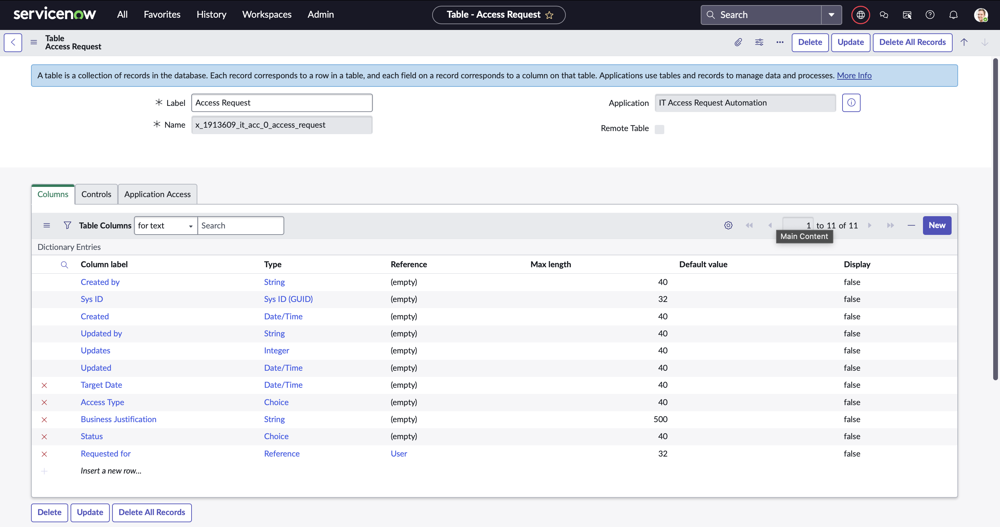
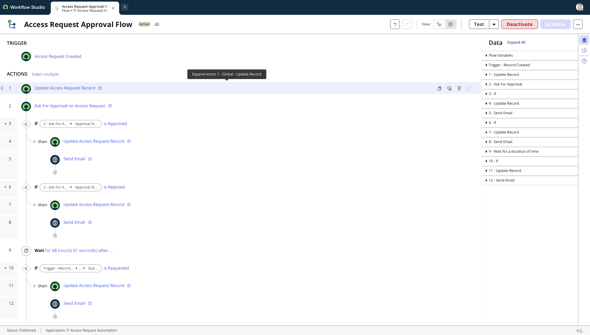
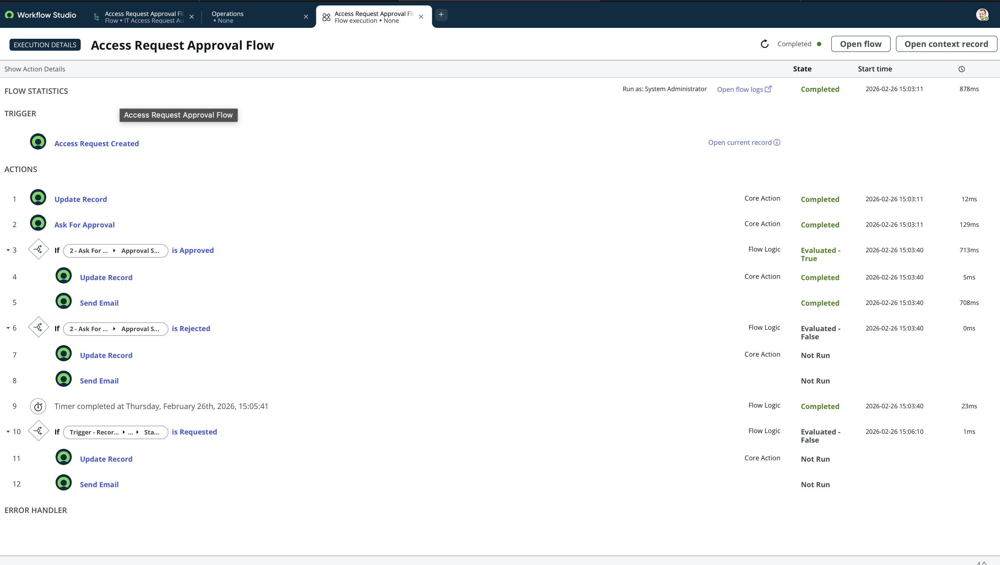

# IT Access Request Automation (ServiceNow)

## 📌 Project Overview
This project implements an automated IT Access Request approval workflow using ServiceNow Flow Designer.

The system:
- Creates an Access Request record
- Sends approval to the selected user
- Updates status based on approval or rejection
- Sends notification emails
- Escalates if no response within 48 hours

---

## 🛠 Technologies Used
- ServiceNow
- Flow Designer
- Custom Table
- Email Notification
- Approval Engine

---

## 📊 Table Structure

Custom Table: **Access Request**

Fields:
- Requested for (Reference → User)
- Access Type (Choice)
- Business Justification (String)
- Status (Choice)
- Target Date (Date/Time)

Screenshot:

---

## 📝 Form View

The form captures request details and tracks approval status.

---

## 🔁 Flow Design

Flow Trigger:
- When Access Request is created

Flow Logic:
1. Update record status to Requested
2. Ask for approval
3. If Approved → Update status + Send email
4. If Rejected → Update status + Send email
5. Wait 48 hours
6. If still Requested → Escalate

---

## ✅ Flow Execution Proof

Approved flow execution:

---

## 🚀 Key Learning Outcomes
- Implemented conditional logic in Flow Designer
- Configured approval rules
- Designed escalation mechanism
- Configured email notifications
- Built custom ServiceNow application

---

## 👤 Author
Gurram Vishwajith Reddy
